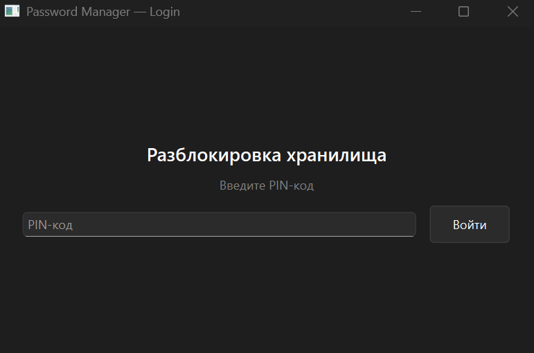
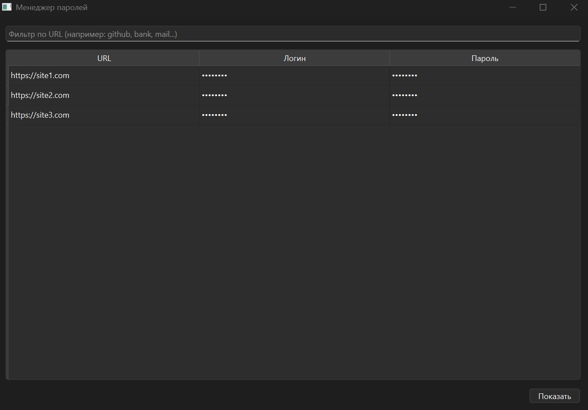

# Password Manager — Zamotina 221-331

Лабораторная работа 1 по дисциплине «Разработка и эксплуатация автоматизированных систем в защищенном исполнении».

**Цель:** реализация защиты приложения Windows от утечек данных, отладки и модификации.

**Задача:** разработка приложения для безопасного хранения учетных данных (URL, логин, пароль) с шифрованием AES-256 и комплексной защитой от кражи данных, атак с использованием отладки и модификации исполняемого модуля.

## Скриншоты

<!-- Вставьте скриншоты в папку screenshots/ и раскомментируйте строки ниже -->
<!--  -->
<!--  -->

## Этап 1: Базовое приложение

### Окно аутентификации
- Ввод пин-кода для разблокировки хранилища

### Окно хранилища учетных данных
- Отображение учетных данных в таблице (URL, логин, пароль)
- Логины и пароли **маскированы** символами `*` по умолчанию
- Кнопка для раскрытия/скрытия данных
- Фильтрация записей по URL
- Адаптивный интерфейс, подстраивающийся под изменение размера окна

## Этап 2: Реализация защиты

### 1. Шифрование данных (AES-256)

Файл с учетными данными (`credentials.json`) зашифрован алгоритмом **AES-256-CBC** через библиотеку OpenSSL. Пин-код преобразуется в ключ шифрования. 

- `VaultRepository::pinToKey()` — преобразование пин-кода в 256-битный ключ
- `VaultRepository::aesEncrypt()` / `aesDecrypt()` — шифрование/дешифрование данных
- `VaultRepository::encryptSecretToB64()` / `decryptSecretFromB64()` — шифрование пар логин/пароль

### 2. Защита от отладки: IsDebuggerPresent()

При запуске приложение вызывает WinAPI-функцию `IsDebuggerPresent()`. Если обнаружен подключённый отладчик — отображается предупреждение и приложение завершается **до ввода пин-кода**.

**Файл:** `main.cpp`, функция `checkForDebugger()`

```cpp
if (IsDebuggerPresent()) {
    QMessageBox::critical(nullptr, "Ошибка безопасности",
                          "Обнаружен отладчик. Программа не может быть запущена.");
    return true;
}
```

### 3. Защита от отладки: Самоотладка (приложение-спутник)

Приложение-спутник `debugger-protection` реализует метод «самоотладки»:

1. **`CreateProcessW()`** — запускает менеджер паролей в отдельном процессе
2. **`DebugActiveProcess()`** — подключается к процессу как отладчик
3. **`WaitForDebugEvent()` + `ContinueDebugEvent()`** — обрабатывает отладочные события в цикле

Поскольку к процессу Windows может быть подключён **только один отладчик**, внешний отладчик (x64dbg, WinDbg) не сможет подключиться к менеджеру паролей, пока к нему привязан спутник.

**Файл:** `debugger-protection/debugger-protection.cpp`

### 4. Защита от модификации: контрольная сумма .text

При каждом запуске приложение проверяет целостность своего исполняемого модуля:

1. Определяет **виртуальный адрес** начала сегмента `.text` через разбор PE-заголовков (DOS Header → NT Header → Section Headers)
2. Определяет **размер** сегмента `.text`
3. Читает секцию `.text` из файла на диске и вычисляет **SHA-256** хеш-сумму
4. Сравнивает вычисленную сумму с **эталонной**, зашитой в коде
5. Если суммы не совпадают — отображает предупреждение о модификации и завершает работу

Эталонный хеш хранится в секции `.rdata` (константные данные), поэтому его изменение в исходном коде не влияет на содержимое `.text`.

**Файл:** `main.cpp`, функция `verifyTextSectionSha256()`